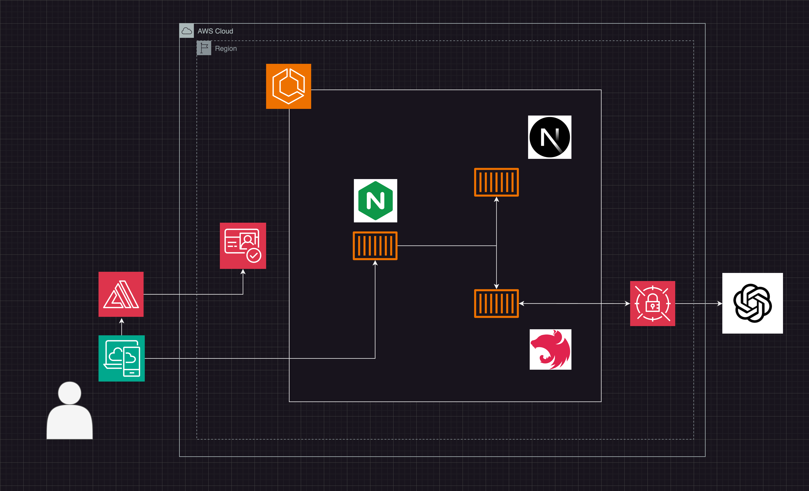

# アーキテクチャ図

このヴァージョンではフロントに NEXTJS をバックエンドに NESTJS を使用しています。NEXTJS のビルド時にできる out フォルダーはエンジンエックスに保存しています。API にリクエストが来た場合は、エンジンエックスが NEXTJS サーバーの API にパスし、そこから NESTJS に繋ぎます。NESTJS のコンテナには直接アクセスできず、フロントの NEXTJS を経由してアクセスします。
